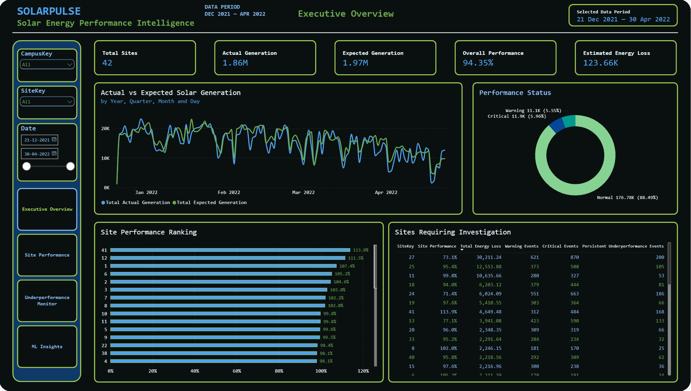
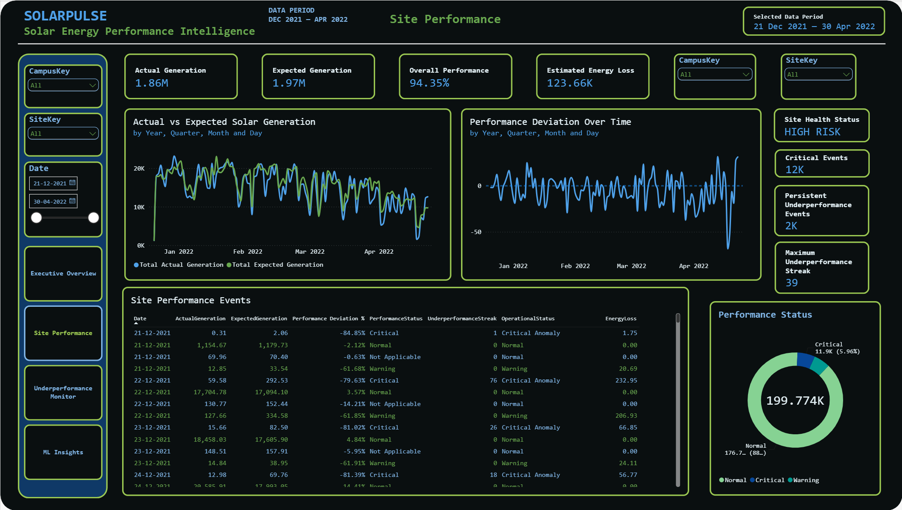
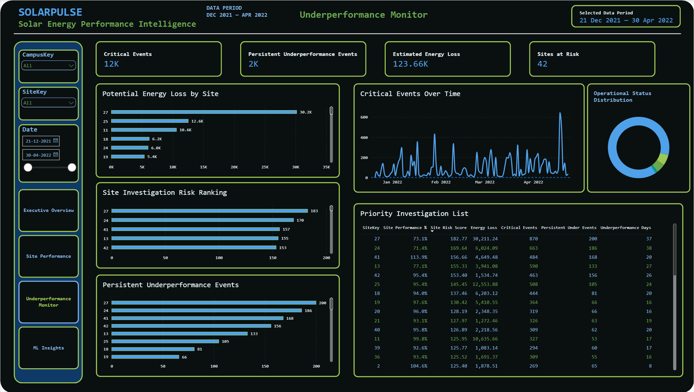
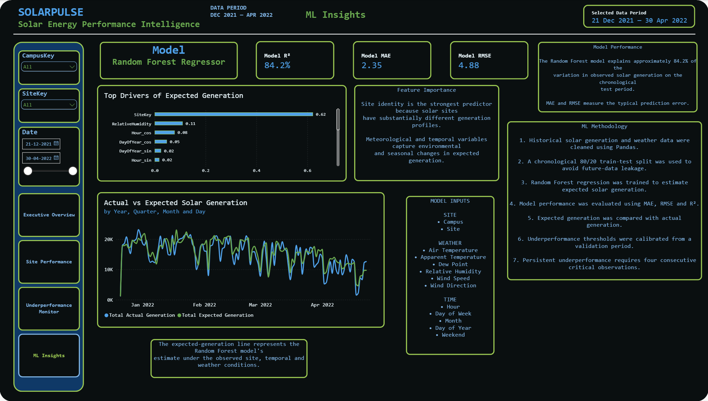
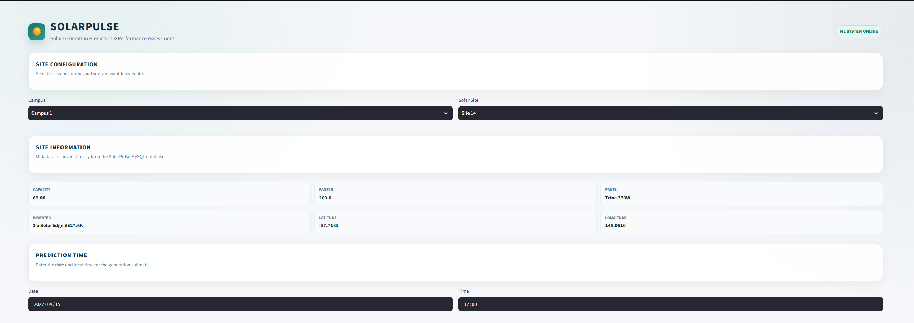
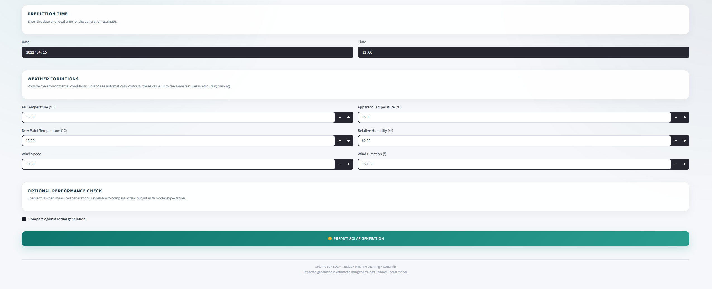
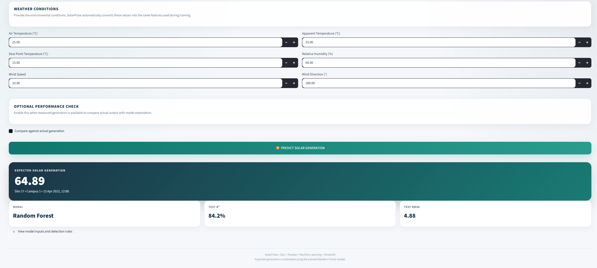

# SolarPulse 🌞
## Solar Energy Underperformance Detection System

SolarPulse is an end-to-end **solar energy analytics and machine-learning system** designed to identify potential underperformance in solar generation.

The system uses historical solar generation, site information, weather conditions, and time-based features to estimate **expected energy generation**. It then compares expected generation with actual recorded generation to identify potential underperformance and classify it as **Normal, Warning, or Critical**.

### Technology Stack

- **MySQL** — structured data storage and SQL auditing
- **Python / Pandas** — data cleaning and preprocessing
- **Scikit-learn Random Forest** — expected-generation prediction
- **SQL Views** — analytical reporting layer
- **Power BI** — interactive dashboards
- **Streamlit** — interactive prediction application

---

## 1. Project Objective

Solar installations can generate less energy than expected because of weather conditions, site-specific behavior, shading, soiling, equipment issues, measurement problems, or other operational factors.

SolarPulse answers:

> **"Given the solar site, time, and weather conditions, how much energy should the site reasonably generate, and is the actual generation significantly below that expectation?"**

The overall pipeline is:

```text
UNISOLAR Raw Data
        ↓
MySQL Database
        ↓
SQL Data Audit
        ↓
Python / Pandas Cleaning
        ↓
Feature Engineering
        ↓
Random Forest Model
        ↓
Expected Energy Generation
        ↓
Performance Deviation
        ↓
Normal / Warning / Critical
        ↓
Persistent Underperformance
        ↓
Power BI + Streamlit
```

---

# 2. Dataset

SolarPulse is built using the **UNISOLAR** dataset.

The project works with four source files:

| Dataset | Purpose |
|---|---|
| `Solar_Site_Details.csv` | Static information about solar sites |
| `Solar_Energy_Generation.csv` | Site-level solar generation observations |
| `Weather_Data_reordered_all.csv` | Campus-level weather observations |
| `Monthly_Summary_Solar.csv` | Monthly/yearly generation summary information |

### Important dataset concepts

- `CampusKey` identifies the campus.
- `SiteKey` identifies an individual solar installation.
- `kWp` represents the installed/rated peak capacity of a solar site.
- `SolarGeneration` is treated as **energy generated during a 15-minute observation, in kWh**.
- Weather variables include temperature, humidity, dew point, wind speed, and wind direction.
- Generation is site-level, while weather observations are campus-level.

---

# 3. Project Architecture

```text
                         ┌─────────────────────┐
                         │   UNISOLAR CSVs     │
                         └──────────┬──────────┘
                                    │
                                    ▼
                         ┌─────────────────────┐
                         │       MySQL         │
                         │    Raw Tables       │
                         └──────────┬──────────┘
                                    │
                                    ▼
                         ┌─────────────────────┐
                         │    SQL Data Audit   │
                         └──────────┬──────────┘
                                    │
                                    ▼
                         ┌─────────────────────┐
                         │ Python / Pandas     │
                         │ Cleaning & Features │
                         └──────────┬──────────┘
                                    │
                                    ▼
                         ┌─────────────────────┐
                         │  Random Forest ML   │
                         │ Expected Generation │
                         └──────────┬──────────┘
                                    │
                                    ▼
                         ┌─────────────────────┐
                         │ Performance Logic   │
                         │ Deviation / Status  │
                         │ Energy Loss         │
                         └──────────┬──────────┘
                                    │
                    ┌───────────────┴───────────────┐
                    ▼                               ▼
          ┌──────────────────┐             ┌─────────────────┐
          │     Power BI     │             │    Streamlit    │
          │    Dashboards    │             │ Prediction App │
          └──────────────────┘             └─────────────────┘
```

---

# 4. Project Structure

```text
SolarPulse/
│
├── app/
│   └── app.py
│
├── data/
│   ├── Solar_Site_Details.csv
│   ├── Monthly_Summary_Solar.csv
│   ├── Weather_Data_reordered_all.csv
│   ├── Solar_Energy_Generation.csv
│   └── processed_ml_data.pkl              # Large; not committed to GitHub
│
├── ml/
│   ├── solar_generation_model.pkl         # Large; not committed to GitHub
│   └── detector_config.json
│
├── notebooks/
│   ├── 01_Data_Cleaning_and_Preparation.ipynb
│   └── 02_ML_Modeling_and_Underperformance.ipynb
│
├── python/
│   ├── database.py
│   └── import_data.py
│
├── sql/
│   ├── 01_create_database_and_tables.sql
│   ├── 02_sql_data_audit.sql
│   └── 03_performance_table_and_views.sql
│
├── images_and_videos/
│   ├── dashboard_images/
│   │   ├── Executive_Overview.png
│   │   ├── ML_Insights.png
│   │   ├── Site_Performance.png
│   │   └── Underperformance_monitor.png
│   │
│   └── app_images_and_videos/
│       ├── app_pic1.png
│       ├── app_pic2.png
│       ├── app_pic3.png
│       └── SolarPulse_App_Video.mp4
│
├── requirements.txt
├── README.md
└── .gitignore
```

> **Note:** Windows Explorer may hide file extensions. If your real assets use different image/video extensions, update the paths in this README.

---

# 5. File-by-File Explanation

## `app/app.py`

Main **Streamlit application**.

The app allows users to:

1. Select a campus/site.
2. Enter date and time.
3. Enter weather conditions.
4. Predict expected energy generation.
5. Optionally enter actual generation.
6. Calculate performance deviation.
7. Display the performance status.

The application loads the saved model and detector configuration and uses the same feature structure expected by the trained model.

---

## `data/Solar_Site_Details.csv`

Static solar-site metadata, including fields such as:

- `CampusKey`
- `SiteKey`
- `kWp`
- `Number_of_Panels`
- `Panel`
- `Inverter`
- `Optimizers`
- Latitude/Longitude

It describes the solar installation rather than its time-series output.

---

## `data/Solar_Energy_Generation.csv`

Time-series generation records containing:

- `CampusKey`
- `SiteKey`
- `Timestamp`
- `SolarGeneration`

This is the primary source of actual observed energy generation.

---

## `data/Weather_Data_reordered_all.csv`

Campus-level weather observations.

Important fields include:

- `AirTemperature`
- `ApparentTemperature`
- `DewPointTemperature`
- `RelativeHumidity`
- `WindSpeed`
- `WindDirection`

These provide environmental context for expected-generation prediction.

---

## `data/Monthly_Summary_Solar.csv`

Monthly/yearly site-generation summary data, including:

- `SiteKey`
- `Year`
- `DataStatus`
- `AverageSolarGeneration`
- `MaxSolarGeneration`
- `MinSolarGeneration`

Used mainly for summary analysis and validation of the source data.

---

## `data/processed_ml_data.pkl`

The cleaned and feature-engineered dataset generated by the preprocessing workflow.

It contains model-ready observations after cleaning, alignment and feature engineering.

### Why it is not in GitHub

It can be too large for normal repository storage.

It can be regenerated by running:

```text
notebooks/01_Data_Cleaning_and_Preparation.ipynb
```

---

## `python/database.py`

Contains the MySQL connection logic used by the Python scripts.

The project uses:

- SQLAlchemy
- PyMySQL
- MySQL

Do not store real database passwords in this file when publishing the repository.

---

## `python/import_data.py`

Loads the source CSV data into the MySQL raw tables.

Conceptually:

```text
CSV files
   ↓
Pandas
   ↓
Data preparation
   ↓
SQLAlchemy
   ↓
MySQL raw tables
```

---

# 6. SQL Files

## `sql/01_create_database_and_tables.sql`

Creates the `solarpulse` database and the raw tables:

- `solar_sites`
- `monthly_summary`
- `weather_raw`
- `generation_raw`

This establishes the database structure before data import.

---

## `sql/02_sql_data_audit.sql`

Performs post-import data-quality checks such as:

- Row counts
- Missing generation values
- Zero and negative generation
- Minimum/maximum/average generation
- Timestamp coverage
- Number of sites
- Missing generation by site
- Site-level generation statistics
- Duplicate records
- Referential integrity
- Weather missing values
- Weather ranges
- Weather timestamp coverage
- Missing site metadata
- Monthly summary validity

Its purpose is to answer:

> **"Did the raw data load correctly, and what data-quality issues exist?"**

---

## `sql/03_performance_table_and_views.sql`

Creates the analytical performance layer.

### `performance_results`

Stores:

- Actual generation
- Expected generation
- Residual
- Performance deviation
- Performance ratio
- Performance status
- Underperformance streak
- Persistent-underperformance flag
- Operational status
- Potential energy loss

### `vw_solar_performance`

Detailed view combining performance results with solar-site metadata.

### `vw_site_performance`

Site-level aggregation containing:

- Actual generation
- Expected generation
- Energy loss
- Average deviation
- Average performance ratio
- Warning events
- Critical events
- Persistent events

These views are used by Power BI.

---

# 7. Jupyter Notebooks

## `notebooks/01_Data_Cleaning_and_Preparation.ipynb`

Performs the Python/Pandas preprocessing pipeline.

Main tasks:

### Data inspection

- Load the source files
- Check shapes and columns
- Inspect data types
- Review descriptive statistics
- Investigate missing values

### Missing-value handling

Generation and weather are handled differently.

**Generation:**
- Missing generation is not blindly converted to zero.
- Missing measurement and zero production are different conditions.
- Replacing missing generation with zero could create false underperformance events.

**Weather:**
- Short temporal gaps can be interpolated with a limited gap.
- Longer gaps are handled using contextual campus/month/hour statistics with broader fallback values where appropriate.
- Where no weather observation exists for a period, weather is not fabricated.

### Outlier handling

Physically impossible values are investigated.

Unusual generation values are not automatically removed because unusually low values may be legitimate underperformance events.

### Data alignment

Generation and weather are aligned using:

```text
CampusKey + Timestamp
```

because generation is site-level and weather is campus-level.

### Feature engineering

The primary deployment feature set is:

```text
CampusKey
SiteKey
AirTemperature
ApparentTemperature
DewPointTemperature
RelativeHumidity
WindSpeed
WindDirection_sin
WindDirection_cos
Hour_sin
Hour_cos
DayOfYear_sin
DayOfYear_cos
DayOfWeek
Month
IsWeekend
```

---

## `notebooks/02_ML_Modeling_and_Underperformance.ipynb`

Performs the modelling and detection workflow:

1. Load processed ML data.
2. Define the target.
3. Create chronological training/validation/test periods.
4. Train a baseline.
5. Train the Random Forest model.
6. Evaluate MAE, RMSE and R².
7. Inspect feature importance.
8. Generate expected-generation predictions.
9. Calculate performance deviation.
10. Calibrate Warning/Critical thresholds on validation data.
11. Detect persistent underperformance.
12. Estimate potential energy loss.
13. Save model and detector configuration.

---

# 8. Machine Learning

SolarPulse uses a:

```text
RandomForestRegressor
```

Configuration:

```text
n_estimators = 100
max_depth = 20
min_samples_leaf = 2
random_state = 42
n_jobs = -1
```

### Why Random Forest?

The relationship between solar generation and inputs such as site, temperature, humidity, wind and time is nonlinear.

Random Forest can model nonlinear relationships and interactions by combining many decision trees.

### Bootstrap sampling

Random Forest trains each tree on a bootstrap sample of the training data, created by sampling observations with replacement.

This creates diversity between trees. Random feature selection at splits creates additional diversity, and the tree predictions are aggregated to produce the final expected-generation prediction.

---

# 9. Model Evaluation

Primary model results:

| Metric | Result |
|---|---:|
| MAE | 2.3534 kWh |
| RMSE | 4.8842 kWh |
| R² | 0.8420 |

Baseline results:

| Metric | Result |
|---|---:|
| MAE | 6.9220 kWh |
| RMSE | 12.3342 kWh |
| R² | -0.0077 |

An R² of approximately **0.842** indicates that the model explains a large proportion of the variation in generation within the evaluated data period.

---

# 10. Why the Data Split is Chronological

Solar generation is time-series data.

A random split can allow information from later time periods to influence the training data while earlier observations are used for evaluation.

SolarPulse therefore follows:

```text
Earlier data → Training
Middle data  → Validation
Later data   → Test
```

This better represents real deployment.

---

# 11. Underperformance Detection

After the Random Forest predicts expected generation, SolarPulse compares it with actual generation.

### Performance Deviation

```text
(Actual - Expected) / Expected × 100
```

Example:

```text
Actual   = 12.25 kWh
Expected = 69.77 kWh
```

Result:

```text
Performance Deviation ≈ -82.44%
```

This means actual generation is approximately 82.44% below expected generation.

---

# 12. Normal / Warning / Critical

The source UNISOLAR dataset did **not** contain these labels.

SolarPulse derives them using the project's performance-deviation rules.

Approximate thresholds:

| Performance Deviation | Status |
|---|---|
| Above -57.42% | Normal |
| -57.42% to -69.57% | Warning |
| ≤ -69.57% | Critical |

These are **project-specific operational thresholds**, calibrated from validation-period deviations. They are not universal industry thresholds.

---

# 13. Persistent Underperformance

A single critical observation may be temporary.

SolarPulse uses:

```text
4 consecutive Critical observations
≈ 1 hour
```

because the generation interval is approximately 15 minutes.

This produces a `PersistentUnderperformance` indicator.

---

# 14. Energy Loss

When actual generation is lower than expected, the potential energy loss is estimated as:

```text
Expected Generation - Actual Generation
```

This helps quantify the apparent gap between expected and observed energy generation.

---

# 15. Important Interpretation

SolarPulse is a **detection and prioritization system**.

A `Critical` status does **not prove** that an inverter, panel, cable, or other component has failed.

It means:

> **The site is generating substantially less energy than the model expects under the supplied conditions and therefore deserves investigation.**

---

# 16. Power BI Dashboard

SolarPulse contains four main Power BI pages.

## Executive Overview

High-level portfolio view showing overall generation and performance indicators.



## Site Performance

Comparison of individual solar sites, their generation and performance behavior.



## Underperformance Monitor

Focused view of warning, critical and persistent underperformance events.



## ML Insights

Machine-learning-focused view showing model and performance insights.



---

# 17. Streamlit Application

The Streamlit application allows users to:

```text
Select Site
    ↓
Select Date & Time
    ↓
Enter Weather Conditions
    ↓
Generate Expected Energy
    ↓
(Optional) Enter Actual Energy
    ↓
Calculate Deviation
    ↓
Display Status
```

### Application Screenshots







### Application Demo

[▶ Watch the SolarPulse Streamlit App Demo](images_and_videos/app_images_and_videos/SolarPulse_App_Video.mp4)

---

# 18. Installation Requirements

Recommended:

- Python 3.11+
- MySQL
- Power BI Desktop
- Git
- VS Code or another code editor

---

# 19. Step-by-Step Setup

## Step 1 — Clone the repository

```bash
git clone <YOUR_GITHUB_REPOSITORY_URL>
cd SolarPulse
```

---

## Step 2 — Create the virtual environment

Windows PowerShell:

```powershell
python -m venv .v1
.\.v1\Scripts\activate
```

Upgrade pip:

```powershell
python -m pip install --upgrade pip
```

---

## Step 3 — Install dependencies

```powershell
pip install -r requirements.txt
```

---

## Step 4 — Create the MySQL database

Open MySQL Workbench or the MySQL command line and run:

```text
sql/01_create_database_and_tables.sql
```

This creates:

```text
solarpulse
├── solar_sites
├── monthly_summary
├── weather_raw
└── generation_raw
```

---

## Step 5 — Configure the database connection

Open:

```text
python/database.py
```

Make sure the MySQL connection points to:

```text
Database: solarpulse
```

Use your local MySQL username/password.

Never commit real credentials to GitHub.

---

## Step 6 — Add the UNISOLAR CSV files

Place the four source files inside:

```text
data/
```

Expected files:

```text
Solar_Site_Details.csv
Monthly_Summary_Solar.csv
Weather_Data_reordered_all.csv
Solar_Energy_Generation.csv
```

---

## Step 7 — Import data into MySQL

Run:

```powershell
python python/import_data.py
```

This loads the source data into the raw SQL tables.

---

## Step 8 — Run the SQL audit

Run:

```text
sql/02_sql_data_audit.sql
```

Review the row counts, missing values, duplicates, ranges and integrity checks.

---

## Step 9 — Run the data-cleaning notebook

Open Jupyter:

```powershell
jupyter notebook
```

Run:

```text
notebooks/01_Data_Cleaning_and_Preparation.ipynb
```

Run the notebook from beginning to end.

This creates the processed ML dataset.

---

## Step 10 — Run the ML notebook

Run:

```text
notebooks/02_ML_Modeling_and_Underperformance.ipynb
```

This:

- trains the model
- evaluates the model
- predicts expected generation
- calculates performance deviation
- derives performance status
- identifies persistent underperformance
- estimates energy loss
- saves the model and detector configuration

Expected generated files:

```text
data/processed_ml_data.pkl
ml/solar_generation_model.pkl
ml/detector_config.json
```

---

## Step 11 — Load performance results into MySQL

Load the generated performance results into the MySQL `performance_results` table using the project's performance-results loading process.

Then run:

```text
sql/03_performance_table_and_views.sql
```

This creates/validates:

```text
performance_results
vw_solar_performance
vw_site_performance
```

---

## Step 12 — Connect Power BI

In Power BI Desktop, connect to MySQL and use:

```text
vw_solar_performance
vw_site_performance
```

These views act as the analytical reporting layer.

---

## Step 13 — Run Streamlit

Make sure these files exist locally:

```text
ml/solar_generation_model.pkl
ml/detector_config.json
```

Then run:

```powershell
streamlit run app/app.py
```

---

# 20. Large Files and GitHub

The following generated files can be too large for normal GitHub repository storage:

```text
data/processed_ml_data.pkl
ml/solar_generation_model.pkl
```

They are therefore intentionally excluded from the repository.

### Reproducibility

The project can regenerate them locally:

```text
UNISOLAR CSVs
      ↓
Data Cleaning Notebook
      ↓
processed_ml_data.pkl
      ↓
ML Notebook
      ↓
solar_generation_model.pkl
```

This means the repository contains the **code required to reproduce the generated artifacts**, without committing large binaries.

### `.gitignore`

A suitable `.gitignore` should contain:

```gitignore
# Python
__pycache__/
*.py[cod]

# Virtual environment
.v1/
venv/

# Environment files
.env

# Jupyter
.ipynb_checkpoints/

# Large generated ML artifacts
data/processed_ml_data.pkl
ml/solar_generation_model.pkl

# OS files
.DS_Store
Thumbs.db
```

For a larger production deployment, alternatives include Git LFS, DVC, cloud object storage, GitHub Releases, or a dedicated model/artifact registry.

---

# 21. Troubleshooting

## MySQL connection error

Check that:

- MySQL is running.
- The username and password are correct.
- The database name is `solarpulse`.
- `PyMySQL` is installed.

```powershell
pip install PyMySQL
```

## Streamlit cannot find the model

Check:

```text
ml/solar_generation_model.pkl
ml/detector_config.json
```

These files are generated locally and are intentionally not stored in GitHub.

## Processed ML dataset is missing

Run:

```text
notebooks/01_Data_Cleaning_and_Preparation.ipynb
```

## Power BI cannot access the views

Check:

- MySQL is running.
- `vw_solar_performance` exists.
- `vw_site_performance` exists.
- The MySQL account has permission to read them.

---

# 22. Key Technical Decisions

### Why wasn't missing generation replaced with zero?

Because missing measurement is not necessarily zero generation. Converting missing values to zero could produce artificial underperformance.

### Why weren't all statistical outliers removed?

Because unusual generation can represent exactly the underperformance events the system is intended to detect.

### Why use a chronological split?

Because the dataset is time-series data and chronological validation better represents future deployment.

### Why sine/cosine encoding?

Time and wind direction are circular variables. Sine/cosine encoding preserves that circular relationship.

### Why is SiteKey important?

Different sites can have very different capacities and site-specific behavior. SiteKey helps the model learn these differences; it should not be interpreted as a physical causal variable.

### Why aren't Normal/Warning/Critical labels present in UNISOLAR?

They are derived by SolarPulse from actual-versus-expected performance rather than being supplied by the original dataset.

---

# 23. Limitations

1. Weather data is campus-level rather than individually measured for every site.
2. The primary model does not directly use solar irradiance as a deployment input.
3. Some site metadata is incomplete in the original dataset.
4. Missing weather periods cannot always be reconstructed reliably.
5. Critical status indicates potential underperformance, not confirmed hardware failure.
6. The thresholds are project-specific and should be revalidated for a new portfolio.
7. The model is trained on historical UNISOLAR data and should be retrained when deployed to substantially different conditions or new sites.

---

# 24. Future Scope

Potential enhancements include:

- Add direct solar irradiance measurements
- Add cloud cover and precipitation
- Add inverter-level telemetry
- Add panel-level data
- Compare Random Forest with XGBoost/LightGBM
- Add anomaly-detection models
- Add SHAP-based explainability
- Automate retraining
- Add real-time IoT ingestion
- Add alert/email notifications
- Move the database to the cloud
- Use an external model/artifact repository for large deployment files

---

# 25. Technologies Used

| Technology | Role |
|---|---|
| Python | Core programming |
| Pandas | Data cleaning and preprocessing |
| NumPy | Numerical operations |
| Scikit-learn | Machine learning |
| Joblib | Model serialization |
| MySQL | Database storage |
| SQLAlchemy | Python-SQL connection |
| PyMySQL | MySQL driver |
| Jupyter | Data science workflow |
| Power BI | Dashboarding |
| Streamlit | Interactive application |
| Git / GitHub | Version control |

---

# 26. Project Outcome

SolarPulse creates a complete pipeline from raw solar data to actionable performance insights.

It can:

- Store and audit large solar datasets
- Clean and prepare historical observations
- Learn expected energy-generation behavior
- Compare expected and actual generation
- Identify significant underperformance
- Detect persistent critical behavior
- Estimate potential energy loss
- Present portfolio and site insights through Power BI
- Provide interactive predictions through Streamlit

The central idea is:

> **Predict what a solar site should generate, compare it with what it actually generated, and highlight meaningful deviations that may require investigation.**

---

# 27. Quick Start

```powershell
# Clone the repository
git clone <YOUR_GITHUB_REPOSITORY_URL>
cd SolarPulse

# Create environment
python -m venv .v1
.\.v1\Scripts\activate

# Install dependencies
pip install -r requirements.txt

# Run SQL:
# sql/01_create_database_and_tables.sql

# Import data
python python/import_data.py

# Run SQL audit:
# sql/02_sql_data_audit.sql

# Run:
# notebooks/01_Data_Cleaning_and_Preparation.ipynb

# Run:
# notebooks/02_ML_Modeling_and_Underperformance.ipynb

# Generate/load performance results

# Run SQL:
# sql/03_performance_table_and_views.sql

# Start Streamlit
streamlit run app/app.py
```

---

## Author

**Aditya Ujjwal**

**Project:** SolarPulse — Solar Energy Underperformance Detection System
